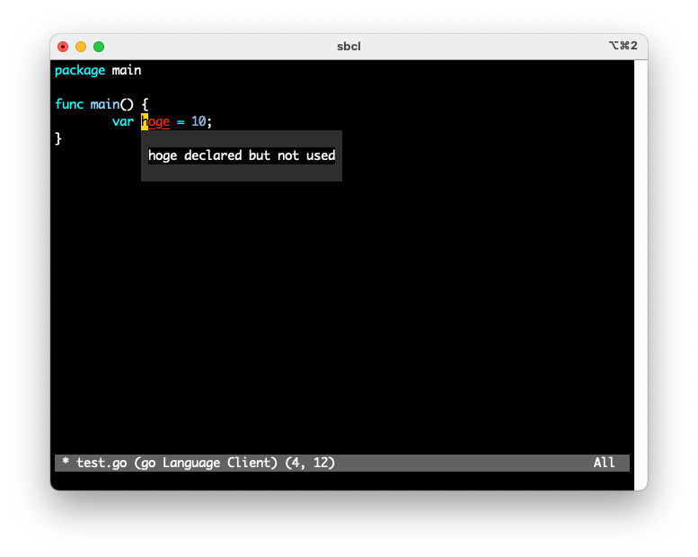
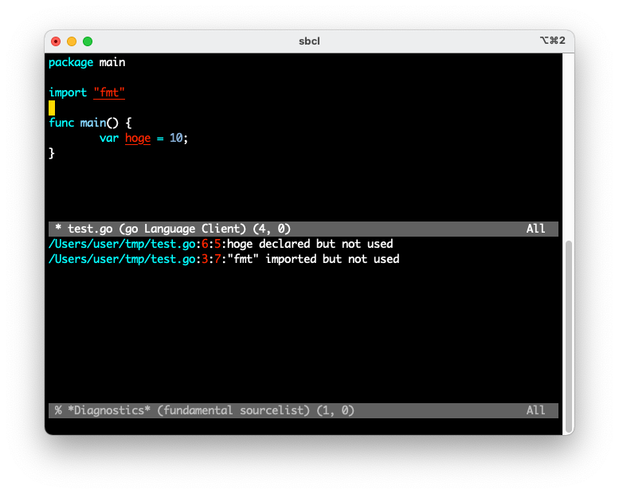
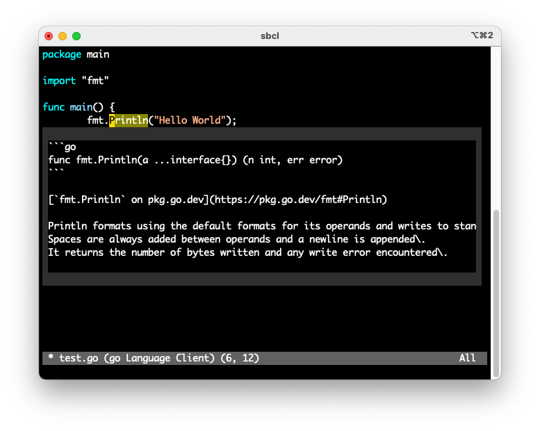
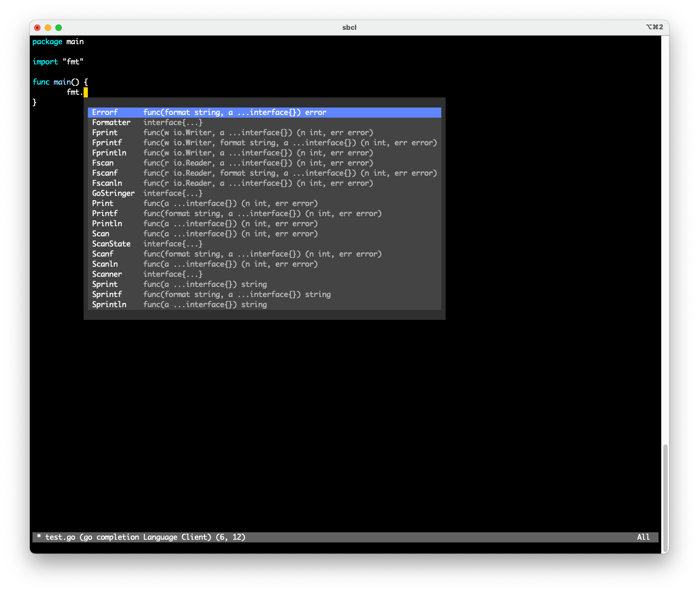
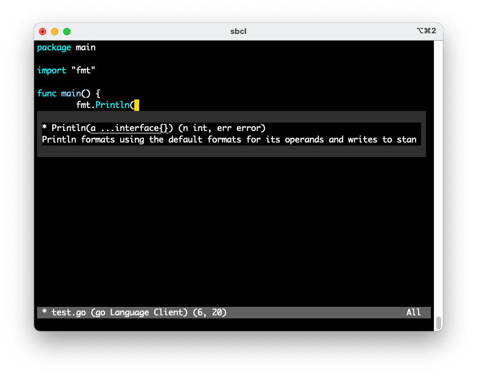
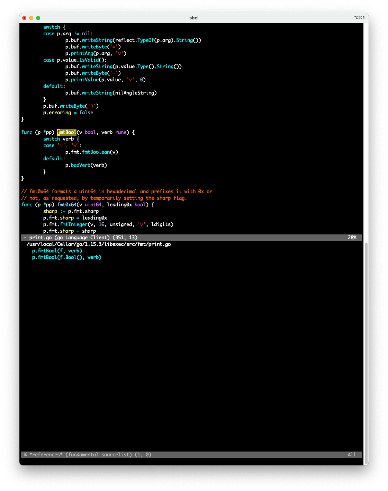
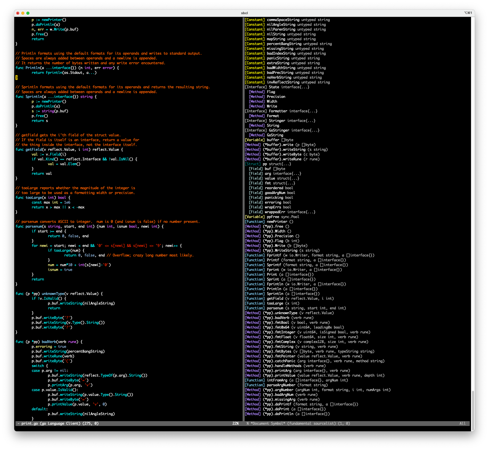

# lem-lsp - LemでLanguage Server Protocolを使う

この記事は[進捗 Advent Calendar 2020](https://github.com/t-sin/shinchoku-advent-calendar-2020)の4日目の記事です

## Language Server Protocolとは

クライアント(Language Client、主にテキストエディタ)とサーバ(Language Server)でjsonrpcを使った通信を用いてエディタでIDEの機能を実現するためのものです。
以前は各言語でばらばらにツールを用意してエディタ側でそれを使っていましたがLanguage Server Protocolの登場以来、色々な言語でLangauge Serverの実装が進んでいて使いたいエディタにLanguage Clientさえあればどの言語に対してもIDEとして使えるようになりました。

## lspの状況

lemでのlspの対応自体は2018年辺りから始めていました。
しかし当時は主なlanguage serverの実装でも実用的に使うには厳しいものが多かったことなどによりやる気を保てませんでした。
たとえば大きなプロジェクトのファイルを開き、初期化リクエストを行うとレスポンスがいつまで経っても返ってこずjsonrpcがタイムアウトエラーを出すなどという問題がありました。

最近になってGoでのオフィシャルなLanguage Serverの実装であるgoplsなどが出てきたり、emacsやvimでもlspを使われはじめるのを見かけることも多くなってようやく実用的に使われはじめてきたように思います。

lemでもこの流れに乗ってlspの恩恵を受けたいと思い開発を再開しました。

## lem-lspの起動方法

今のところlem-lspはexperimentalな機能としているのでデフォルトでは読み込まれていません。
最新のlemでlem-lsp-modeを読み込むことで使えるようになります。

たとえば以下のコマンドでlspを有効にしたlemを起動できます。

```
$ ros -s lem-ncurses -s lem-lsp-mode -e '(ed)'
```

## Goのlanguage serverのインストール

lem-lspの動作確認はGoのlanguage serverであるgoplsを使って行いました。
主観ですがGoでオフィシャルに対応しているという点で他の言語の実装より安心して使えます。

goplsは以下のコマンドでインストールできます。

```
$ GO111MODULE=on go get golang.org/x/tools/gopls@latest
```

## lem-lspで使える機能一覧

以下はlemで実装した機能の一覧です。  
lspのコマンドやキーバインドは暫定的なものなので今後追加/変更をするかもしれません。

lspに対応している言語のファイルを開くとlsp-modeが自動で有効化されます(これを書いている段階ではgoとjavascriptのみ)。  
lsp-mode有効化時、特定のlanguage serverがインストールされていない場合はエラーが出るので事前にインストールしておく必要があります。

|機能名|説明|
|:-|:-|
|publishDiagnostics|コンパイルエラーや警告箇所を画面に表示します|
|hover|関数などの説明を表示します|
|completion|入力の補完を行います|
|signatureHelp|関数のシグネチャの一覧を表示します|
|definition|カーソル位置のシンボルの定義位置へ移動します|
|typeDefinition|カーソル位置のシンボルの型の定義位置へ移動します|
|implementation|カーソル位置のインターフェースの実装へ移動します|
|references|カーソル位置のシンボルが使われている箇所の一覧を出します|
|documentHighlights|カーソル位置の変数などの参照箇所をハイライトします|
|documentSymbols|ファイル内の定義の一覧を出します|
|formatting|ファイルをフォーマットします|
|rename|カーソル位置のシンボルとそれを使っている箇所の名前を変更します|

### publishDiagnostics
編集中のファイルのコンパイルエラーや警告などの診断情報を画面に表示します。



`M-x lsp-document-diagnostics` でそのバッファの診断結果がリストされ、`sourcelist-next(C-x n, M-N)`, `source-previous(C-x p, M-P)` で上下に移動できます。(grep等と同じUI)  
後述するdefinitionやreference、documentSymbols等も同様の操作ができます。



### hover
`M-x lsp-hover`  
カーソル位置のシンボルのドキュメントをポップアップ表示します。



### completion
入力中のシンボルの補完を行います。  
言語によって補完のトリガーとなる文字がlspの初期化時にサーバから送られ(goplsでは`"."`)、その文字の入力によって補完ウィンドウが開きます。  
lemではTabを押下することでも補完できます。



### signatureHelp
関数のシグネチャ一覧を表示します。  
`M-x lsp-signature-help` コマンドか、トリガーとなる文字を入力することで表示できます(goplsでは`"("`, `","`)



### definition
`M-.`  
カーソル位置のシンボルの定義箇所に移動します。
元の位置へ戻るキーは`M-,`です。

### typeDefinition
`M-x lsp-type-definition`  
カーソル位置のシンボルの型定義位置に移動します。

### implementation
`M-x lsp-implementation`  
カーソル位置のインターフェースの実装に移動します。

### references
`M-_`  
カーソル位置のシンボルの参照箇所を一覧します。



### documentHighlights
シンボル位置にカーソルを置くことで対応するシンボルをハイライトします。

### documentSymbols
`M-x lsp-document-symbol`  
バッファ内の全ての定義を一覧します。



### formatting
`M-x lsp-document-format`  
現在のバッファをフォーマットします。

### rename
`M-x lsp-rename`  
カーソル位置のシンボルの名前を変更します。  
別の箇所にある同じシンボルの名前も全て変更されます。

## おわりに
lspには他にもworkspaceの管理やリファクタリングの提案をするcodeActionなどlemではまだ実装の作業途中のものがあります。  

最新のバージョンの3.15.0から追加された仕様には、
時間の掛かる処理の結果を部分的に返すpartial result、
処理中にプログレスバーを表示するための情報を提供するwork done progress等があるようですがいずれもサーバ側の対応が追い付いていないようです。  

これらも追い追いlemで対応していきたいと思います。
